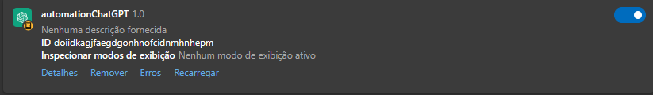

# ChatGPT Automation Bot

Projeto de bot personalizado para enviar automaticamente as perguntas de uma planilha para o chatGPT e em seguida salvar as respostas em uma outra planilha. Vale enfatizar que não há necessidade de conhecimento em programação para o download da extensão e ativação do bot

## Funcionamento

### Instalação e configuração da extensão
1. Copiar a pasta do repositório remoto para o repositório local
2. Acessar o seu navegador e clicar em 'Gerenciar extensões'. Habilitar o 'Modo do desenvolvedor' (no meu caso, utilizei o navegador Edge)
3. Clicar em 'Carregar sem pacote' e em seguida abrir a pasta do repositório local
4. Verificar se a extensão 'automationChatGPT' está habilitada (conforme a imagem abaixo)

### Configuração do bot no facebook
1. Antes de qualquer coisa, abra o arquivo (testGPT.csv) e crie a lista com as perguntas a serem feitas.  Exemplo:
  - pergunta1
  - pergunta2
  - pergunta3
  
    Ou seja, pule uma linha para cada pergunta. Salve em 'Arquivo > Salvar' ou clique nas teclas 'Ctrl + S'. Sempre que atualizar este arquivo, salve, atualizar a extensão e atualizar a página do chatGPT.
2. Abrir o chatGPT e atualizar a página, clicando na tecla 'F5' localizada na parte superior do teclado
3. Na aba do chatGPT, clicar em um chat ou criar um novo
4. Após a página estar totalmente carregada, clique na tecla 'F2'
5. Ao abrir a mensagem de pop-up clique em 'Ok' ou aperte 'Enter'
6. O bot vai parar o funcionamento automaticamente nesses casos: ao atingir o limite de células da planilha que não estão vazias ou quando atualizar/sair da página de funcionamento. O bot vai voltar a funcionar quando clicar na tecla 'F2' novamente
7. Ao atingir o limite de células da planilha que não estão vazias, então vai ser feito o download automático do arquivo (listStorage.csv) que contêm a pergunta que o bot enviou e a resposta que o bot pegou. É uma maneira para revisar os dados obtidos

## Observações

- O chatGPT pode ter restrições com o uso de bots, então use por conta e risco. 
- O bot foi criado com o objetivo de diminuir as ações manuais, melhorar a organização e aumentar o tempo livre. Ou seja, sem objetivos maliciosos
- Deixe a página do chatGPT ativa enquanto o bot estiver em funcionamento, pois caso contrário, o bot pode não funcionar corretamente
- Não tem problema desligar o monitor enquanto o bot estiver em funcionamento, mas configure a economia de energia do seu PC para que a CPU não desligue sozinha por inatividade
- O bot foi testado em um sistema operacional Windows 10 Pro
- Não há necessidade de utilizar o editor de código para configurar o bot, mas quem estiver interessado em contribuir realizando implementações, fique a vontade. Não se esqueça de dar uma estrela ao projeto
- O navegador permite ler o arquivo (testGPT.csv) e transmitir o conteúdo no navegador, mas não permite modificar o arquivo (testGPT.csv), então por isso quando o bot envia todas as perguntas é criado um novo arquivo (listStorage.csv) acrescentando as respostas

## Contato

- E-mail: [jvnogueira2010@gmail.com](mailto:jvnogueira2010@gmail.com)
- LinkedIn: [www.linkedin.com/in/nogueira-jv](https://www.linkedin.com/in/nogueira-jv)
- GitHub: [www.github.com/jv-nogueira](https://github.com/jv-nogueira)